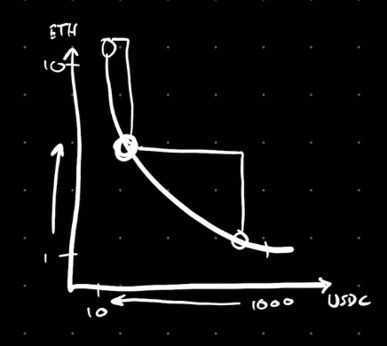

# Curve Finance 

Curve Finance is a decentralized exchange (DEX). Curve Finance focuses on the exchange of stablecoins like USDC or DAI as well as wrapped versions of assets like wBTC or tBTC, despite being similar to other DEXs like Uniswap and Balancer through its low fees and low slippage.

## Why not Uniswap?

The minimum slippage in the curve is 0.03, whereas in Uniswap it's 0.5. So when a trader swaps the stable coin on Uniswap, they get more stable coin in return on Curve. These returns are magnified as the trade gets larger. Users of the Curve who purchase stablecoins can be pretty confident that there won't be any price slippage and that their orders will be filled at the prices they desire. This is due to the fact that stablecoin prices are often dependable and are fixed at a 1:1 ratio to fiat currencies like the dollar.

In contrast, slippage can occur in uniswap trades. You might be shocked by the final purchase price if you utilize Uniswap to trade one cryptocurrency with low price volatility for another with high price volatility. On the Uniswap platform, discrepancies in liquidity among cryptocurrencies can also exacerbate issues with price volatility and slippage.

## How does curve finance work?

Here's the graph of Uniswap and StableSwap (the curve). If I trade a large amount on Uniswap, the token I want to buy will become increasingly expensive. As a result, the more tokens I try to sell, the fewer tokens I receive for the token I desire.

The graph of the curve in the middle is kind of flat, which means if I were to trade in this flat region, I would get a token swap of almost one to one.

So if I swap my ETH for USDC, the pool will get more ETH and less USDC. The point about this curve is that if I have to go from:

It gets very steep. It's a really large jump, meaning the amount of ETH that I get is a lot given that I only have to give a few USDC (see the below figure).

You could say at that point that ETH is really cheap.

The whole point of x * y = k is that we always guarantee liquidity. So the ability to buy or sell inflates the price to a ridiculously high level. You can't ever buy all the USDC because it can't ever reach 0. It becomes inexorably more expensive.

The whole idea of curve finance is that it facilitates swaps between different stablecoins. So if you have USDC, USDT, and DAI, these are all theoretically meant to equal $1 at redemption. However, their prices can fluctuate between $0.95 and $1.05. This is significant because, if USDC is only worth $0.96 and USDT is worth $1.01, there is a $5 difference for every dollar transferred. That is, if I had $100,000 in USDT and wanted to convert it to USDC, I would receive less than $10,000 in USDC. You'll probably get 9600 USDC, which is a net loss of $400. This is ridiculous because both of these coins are equal to exactly $1.

The curve finance uses special curve looks like:

For certain regions, it keeps flat, meaning that when you move between two quantities, the price doesn't really fluctuate that much, whereas on Uniswap, it fluctuates a lot more. The benefit of the flat region is that you have a pretty stable price. However, if you go outside the range, you get a very lopsided range. The reason that this is okay is because the range of stable coins can only be between $0.95 and $1.05. If it varies greater than that, then something else is clearly wrong, and it's actually not a curve problem to keep it within this kind of range that we've defined.

The amazing thing about this particular formula is that the curve can get the slippage (amount of loss between stablecoins) to be literally less than 1%. So in our previous example, rather than losing $400, the most they would lose is maybe $10, which is a massive improvement.
